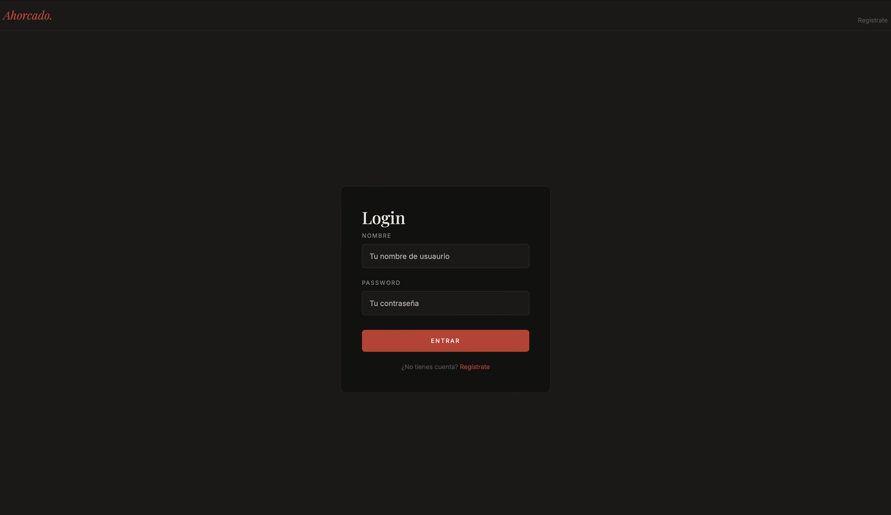
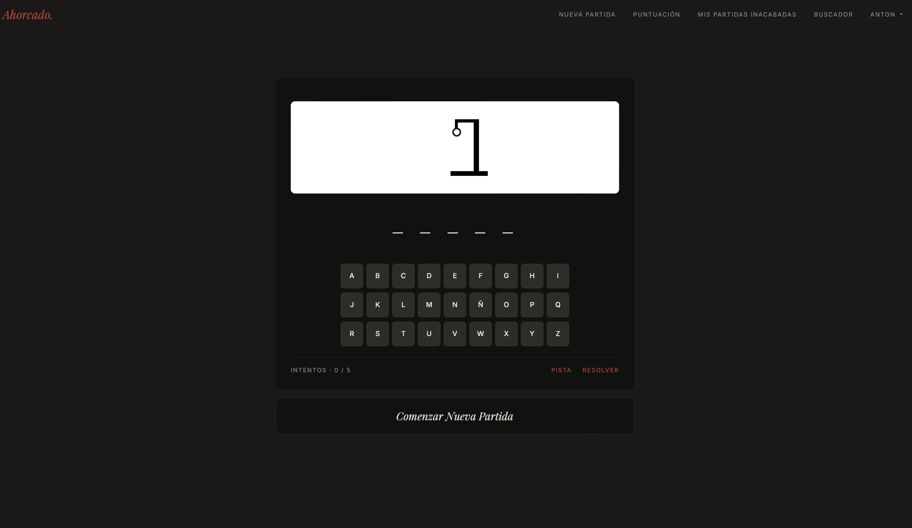
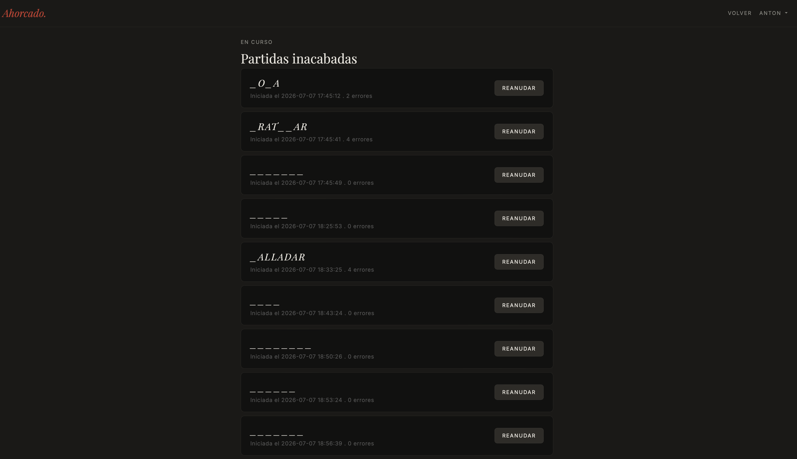
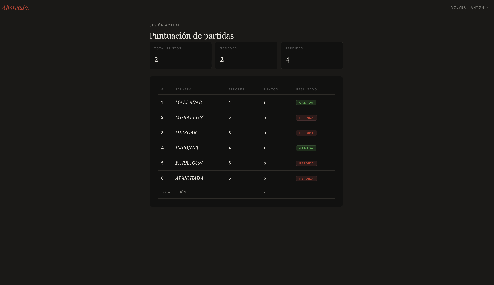
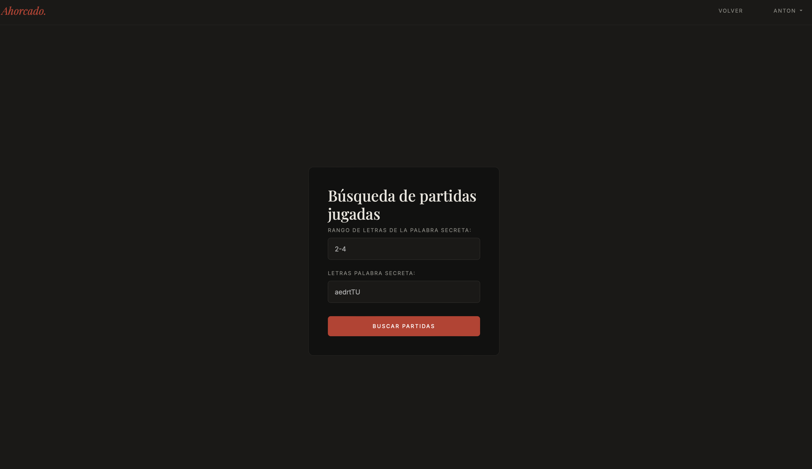
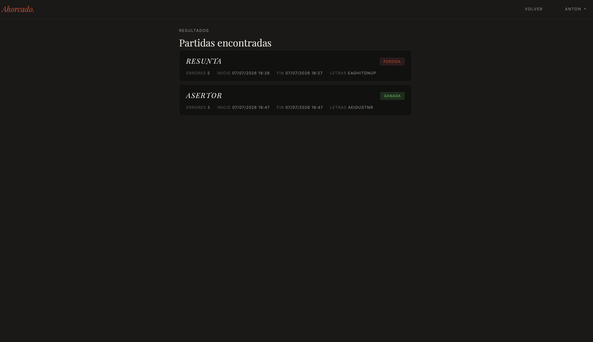

# Juego del Ahorcado

Aplicación web completa del clásico juego del ahorcado desarrollada en PHP con arquitectura MVC, persistencia en base de datos MySQL y diseño moderno.

---

## Capturas de pantalla

| Login | Juego |
|-------|-------|
|  |  |

| Partidas inacabadas | Puntuación |
|---------------------|------------|
|  |  |

| Buscador | Busqueda |
|----------------------------------|-------|
|  |   |

---

## Funcionalidades

### Gestión de usuarios
- Registro de nuevos usuarios con validación de datos
- Login y logout con sesiones PHP
- Edición de perfil — nombre, contraseña, email y nivel de dificultad
- Baja de cuenta con eliminación de datos en BD

### Juego
- Teclado visual interactivo — juega con el ratón o el teclado físico
- Sistema de pistas mediante AJAX — revela la letra más frecuente sin descubrir
- Resolución de partida — adivina la palabra completa en cualquier momento
- Persistencia de partidas en base de datos — inicio, fin y estado

### Niveles de dificultad
- Tres niveles de usuario: Principiante, Intermedio y Avanzado
- Algoritmo de análisis de complejidad de palabras (escala 0-4)
- Las palabras se seleccionan automáticamente según el nivel del jugador

### Historial y estadísticas
- Partidas inacabadas — reanuda cualquier partida pendiente
- Puntuación de sesión — sistema de puntos con bonus por longitud, vocales y errores
- Resumen de partidas ganadas y perdidas con ordenación alfabética
- Buscador de partidas por rango de letras y letras contenidas

---

## Tecnologías

| Tecnología | Uso |
|------------|-----|
| PHP 8.x | Backend y lógica de negocio |
| MySQL | Persistencia de datos |
| PDO | Acceso a base de datos con consultas preparadas |
| BladeOne | Motor de plantillas |
| Bootstrap 5 | Framework CSS |
| Bootstrap Icons | Iconografía |
| jQuery | AJAX y manipulación del DOM |
| JavaScript | Teclado virtual y eventos |
| Google Fonts | Tipografía — Playfair Display + Inter |

---

## 🏗️ Arquitectura

```
juego-ahorcado/
├── public/
│   ├── index.php           # Control de autenticación y perfil
│   ├── juego.php           # Control del juego
│   └── assets/
│       ├── css/
│       │   ├── bootstrap/
│       │   ├── bootstrap-icons/
│       │   └── stylesheet.css
│       ├── js/
            ├── bootstrap/
                  └── bootstrap.bundle.min.js
            ├── jquery/
                  └── jquery-3.6.0.min.js
│       │   ├── teclado.js
│       │   ├── pista.js
│       │   └── resolver.js
│       └── img/
├── src/
│   ├── Modelo/
│   │   ├── Partida.php
│   │   ├── Usuario.php
│   │   └── Nivel.php       # Enum de niveles
│   ├── DAO/
│   │   ├── PartidaDAO.php
│   │   └── UsuarioDAO.php
│   ├── Almacen/
│   │   ├── AlmacenPalabrasFichero.php
│   │   └── IAlmacenPalabras.php
│   ├── Servicios/
│   │   └── AnalizadorComplejidad.php
│   └── BD/
│       └── BD.php
├── vistas/
│   ├── app.blade.php
│   ├── juego.blade.php
│   ├── formlogin.blade.php
│   ├── formperfil.blade.php
│   ├── formularioRegistro.blade.php
│   ├── puntuacionpartidas.blade.php
│   ├── partidasInacabadas.blade.php
│   ├── formbusqueda.blade.php
│   └── partidasencontradas.blade.php
├── bd/
│   └── hangman.sql
└── vendor/


---

## Instalación

### Requisitos
- XAMPP con PHP 8.x y MySQL
- Composer

### Pasos

1. Clona el repositorio en `htdocs`:
bash
git clone https://github.com/Antoniomuda/portfolio.git
cd juego-ahorcado


2. Instala las dependencias:
bash
composer install


3. Importa la base de datos en phpMyAdmin:
   - Abre phpMyAdmin
   - Importa el fichero `bd/hangman.sql`

4. Configura el fichero `.env`:
env
DB_HOST=localhost
DB_PORT=3306
DB_DATABASE=hangman
DB_USUARIO=root
DB_PASSWORD=
RUTA_ALMACEN_PALABRAS=../palabras.txt


5. Abre el navegador en `http://localhost/juego-ahorcado/public/`

### Usuario de prueba

Nombre: anton
Contraseña: 123456

Nombre: rosa
Contraseña: 654321

Nombre: jose
Contraseña: 189320


---

## Patrones de diseño

- **DAO (Data Access Object)** — separación entre lógica de negocio y acceso a datos
- **MVC** — separación entre modelo, vista y controlador
- **Template Method** — BladeOne como motor de plantillas con herencia de vistas
- **Strategy** — interfaz `IAlmacenPalabras` para diferentes fuentes de palabras

---

## Autor

**Antonio Murillo Dávila**  
Desarrollo de Aplicaciones Web — IES Virgen de la Paz, Alcobendas  
Promoción 2024-2026

---

## Licencia
En este proyecto he desarrollado como proyecto personal de portfolio, integrando funcionalidades diferentes en el juego del ahorcado durante el curso 2026 de la asignatura DWES (Desarrollo Web en Entorno Servidor).
